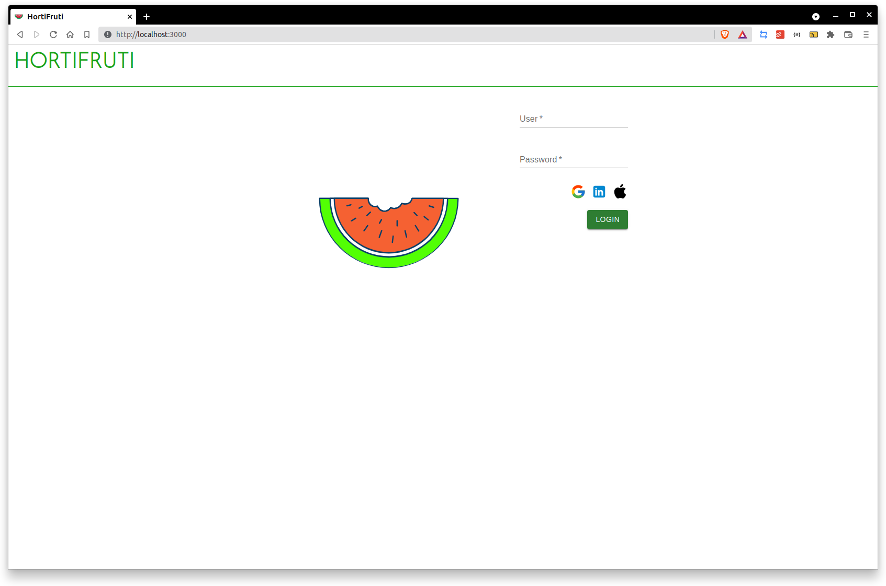
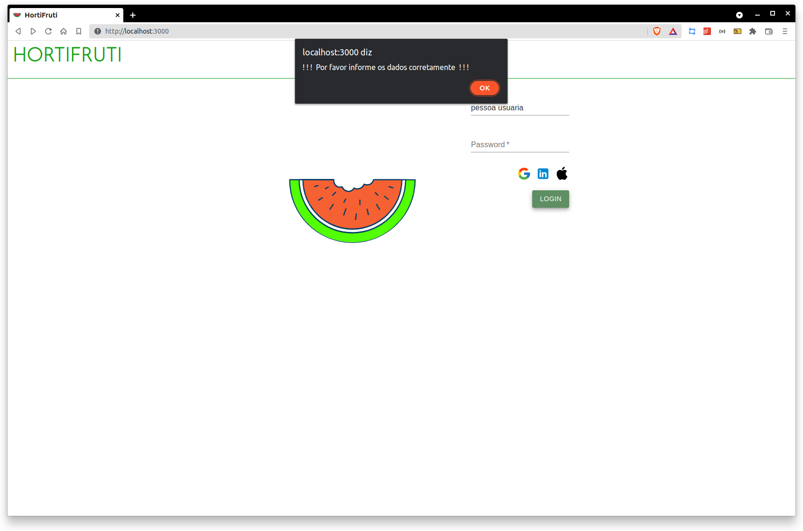
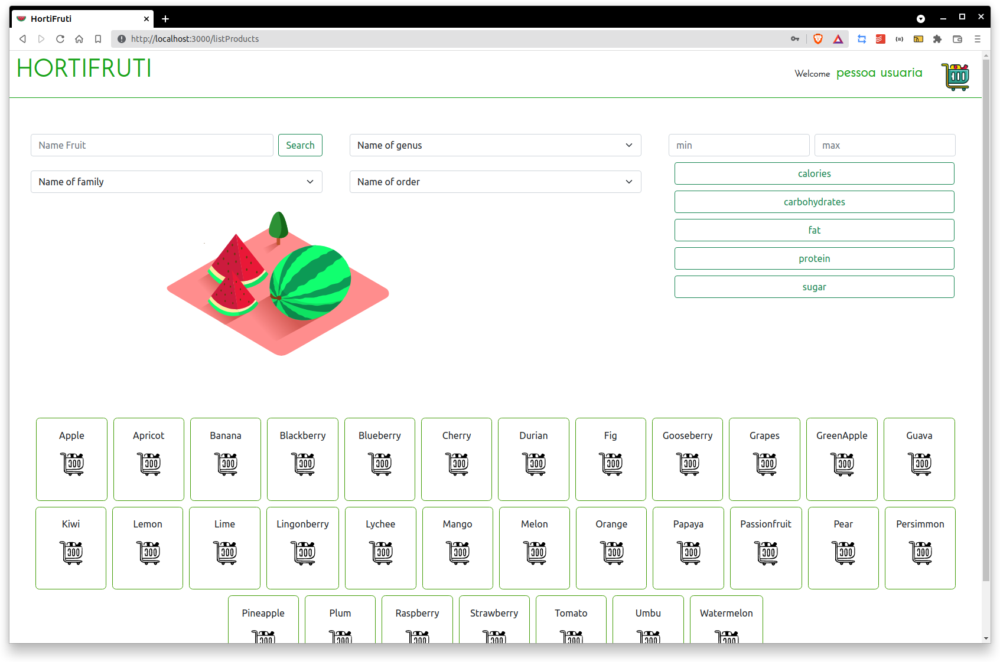
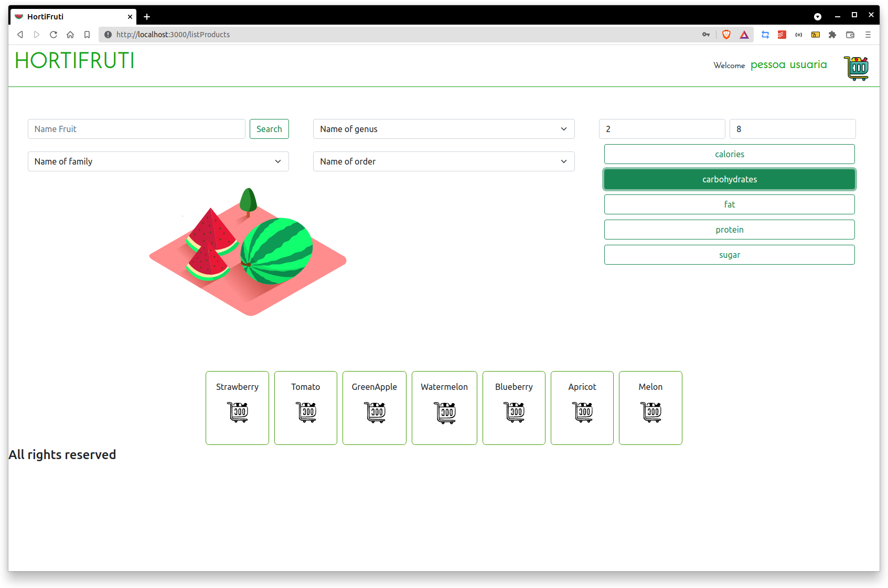
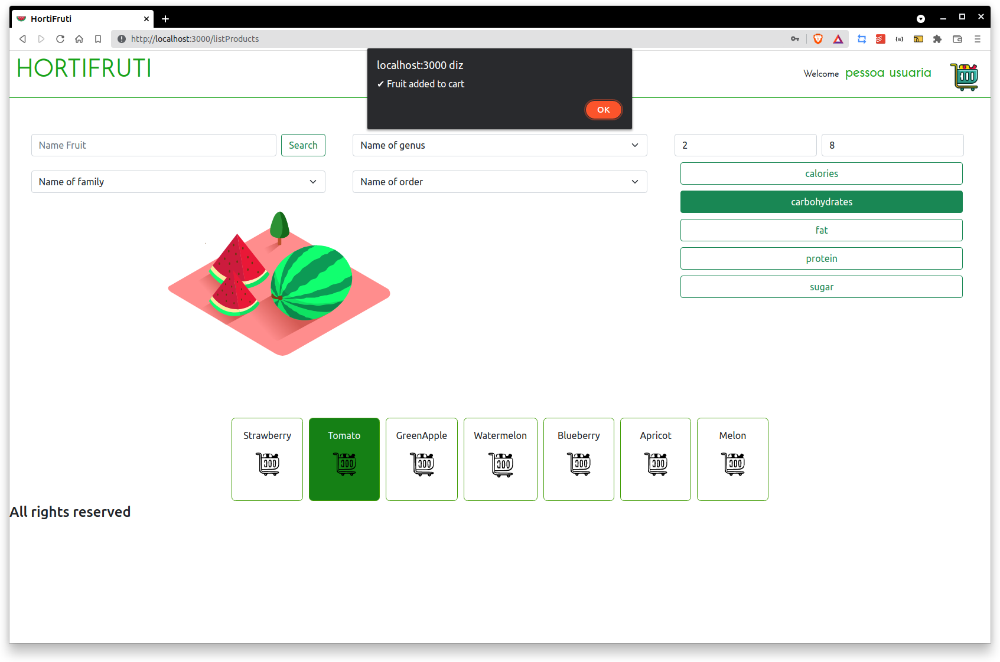
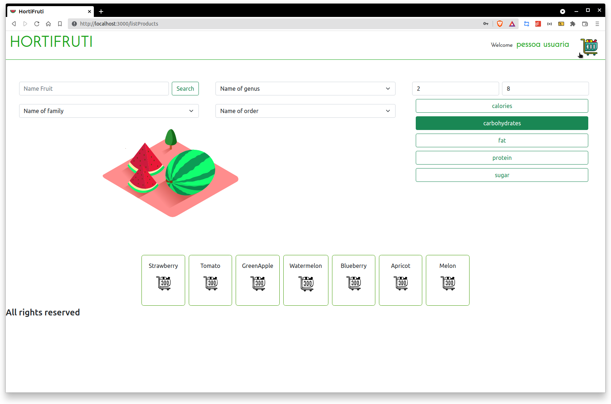
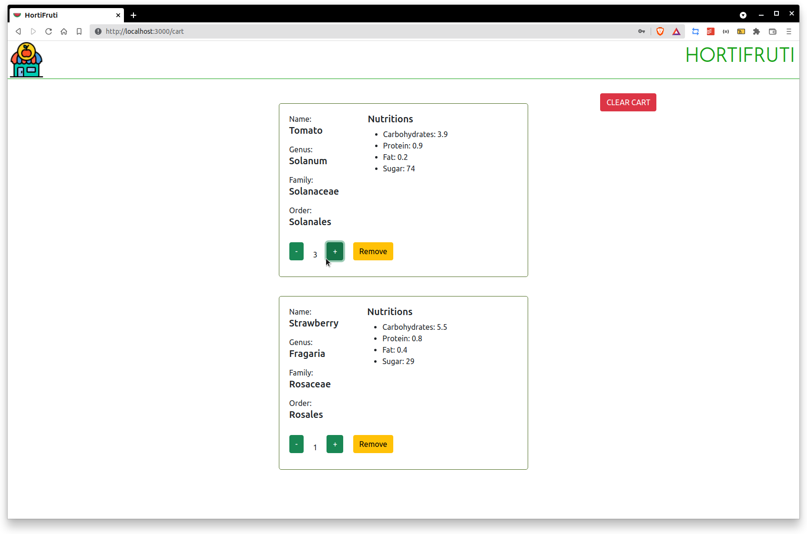

# Projeto Hortifruti

> ## Descrição do projeto

  - O projeto consiste em uma aplicação Web que permite a pessoa usuária buscar por uma ou mais frutas através de várias opções de filtro.
  - Seja por nome, valor calórico, valor proteico, etc.

 

> ## Funcionalidades do projeto
  - A pessoa pode adicionar as frutas desejadas no carrinho controlar a quantidade de cada fruta, remover uma determinada fruta ou limpar o carrinho.
  - No carrinho contém as propriedades de cada fruta *(valor calórico, valor proteico, etc.)*.
  - Também é possível navegar retornando a página principal e adicionar novas frutas.

 

> ## Imagens do projeto

 

### Login:

### Dados Inválidos:

### Principal:

### Aplicando uma dos filtros:

### Adicionando fruta ao carrinho:

### Navegar ao carrinho:

### Manipular a quantidade de cada fruta, remover ou limpar o carrinho:

> ## Documentação da API Fruityvice:
- Serviço “web” que fornece informações sobre todos os categorias de frutas!
- Se você quiser aprender mais informações sobre a API, observe a [documentação](https://www.fruityvice.com/doc/index.html).

